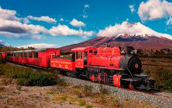
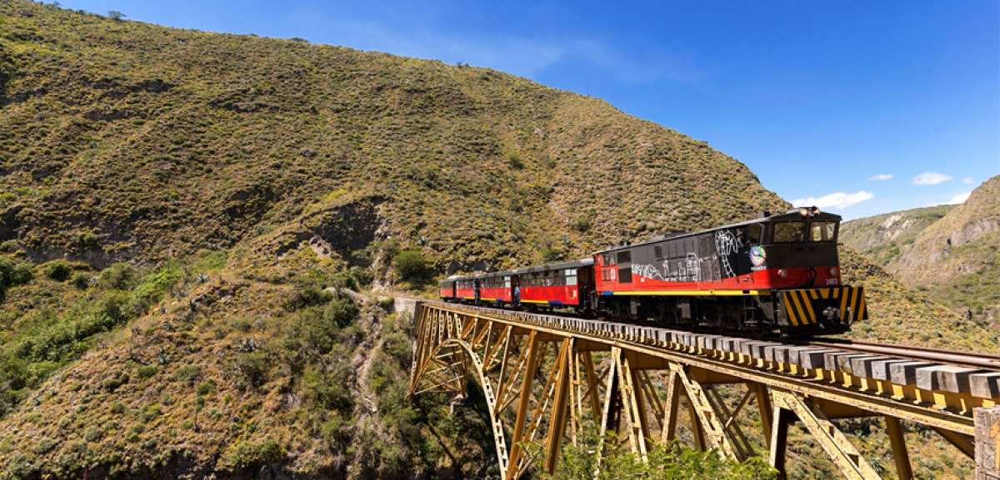

# Practica02-Mi-Sitio-Web-CSS
Pagina web con CSS para programación hipermedial
---------------------------------------------------------------
Configuracion de paginas
index.html
<!DOCTYPE html>
<html lang="es">
<head>
    <meta charset="UTF-8">
    <meta name="keywords" content="cajas, nariz del diablo, puyo, quito,galapagos" />       
   <link type="text/css" rel="stylesheet" href="./css/margen.css"/>   
   <link type="text/css" rel="stylesheet" href="./css/estilos.css"/>
    <title>Lugares Turisticos</title>
    
</head>
<body>
<header>
    
</header>
    <aside class="Publicidad">
            <h1>
                    Opciones
            </h1>
        <nav>
            
            <ul>
                <li><a href="./cajas.html">Cajas</a></li>
                <li><a href="./quito.html">Quito</a></li>
                <li><a href="nariz.html">Nariz del Diablo</a></li>
                <li><a href="puyo.html">Puyo</a></li>
                <li><a href="galapagos.html">Galapagos</a></li>
                <li><a href="index.html">Principal</a></li>
                <li><a href="correo.html">correo</a></li>
            </ul>
        </nav>

        <h1>Publicidad</h1>
        
¿Buscando inspiración viajera? +
        45 millones de lectores nos visitaron desde
        que empezamos el blog  y + 740.00 nos siguen 
        en redes sociales en 2019 (somos uno de los 
        blogs de viaje más leídos de habla hispana) 

        
Ponemos el mundo a tus pies para que conquistes 
        todos los destinos soñados, tu ocúpate de las maletas 
        y nosotros de organizarlo todo.

        
Viajes y destinos, es su mejor guía de blog por televisión,
        única revista turística en Ecuador, que tiene ofertas turísticas
        únicas con excelente garantía y los mejores asesores de viaje

        
          
    </aside>

<section id="Contenido">
        <h1>Bienvenidos</h1>
<article>
        <h2>Atrevete</h2>
       
Descubre la belleza de sus paisajes, a través de la 
       siguiente selección de los mejores lugares turísticos de Ecuador,        
       espectaculares escenarios entre la exuberante selva amazónica,
       bosques tropicales, ciudades coloniales y la magia de las Islas Galápagos.

      
Ecuador se esta colocando entre los primeros destinos turísticos para disfrutar
        en tus vacaciones , ya que cuenta con 4 regiones climáticas
        Ecuador cuenta con grandes atractivos naturales, que sin duda alguna 
        cualquier sitio en el mundo quisiera tener

</article>
<article>
    <h2>​¡El mejor momento para viajar es AHORA!</h2>
    
Algunas deciciones  llevan a mucha gente a renunciar
         y abandonar sus sueños de aventuras. 
         Con tanta información, ¡no se sabe dónde empezar a buscar! 
         ¡Buenas noticias! Hemos puesto a tú disposicion los mejores
         lugares para viajar en Ecuador 

         
Ubicado entre Colombia y Perú, es uno de los países con mayor interés
            turístico debido a sus costumbres y tradiciones. Los lugares para vacacionar 
            en Ecuador son muy variados gracias a la preservación de la biodiversidad del
             medio ambiente y el reforzamiento
            de los valores humanos a través de sus instituciones culturales, que hacen de 
            esta nación un lugar perfecto para explorar.

</article>
<iframe src="https://www.youtube.com/embed/RDbe-4Z5bvQ" frameborder="0" 
allow="accelerometer; autoplay; encrypted-media; gyroscope; picture-in-picture" allowfullscreen></iframe>
</section>

<aside class="Publicidad1">
    <h1>Cometarios</h1>

Hola que tal,queria consultarte si 
    marzo es una buena epoca para visitar ecuador,  
    pregunto mas que nada por el clima.

Hola soy de Argentina y en enero nos vamos con unas amigas 
    a ecuador. Queriamos saber que excursiones son las mas recomendadas, 
    precios y horarios que se puedan realizar. Gracias!

Excelente Blog mi pregunta tengo ganas de ir en Diciembre paseo familiar con mi hijo de 3 
    años es bueno viajar con El pues veo que casi todo es caminatas y que clima 
    hace en Ecuador para esa temporada mil gracias …

Excelente blog, soy de Perú y viajó.para Ecuador llegare en 4 de abril,
     he visto que hay tantos lugares por conocer y no se si me.da el.tiempo….que 
     me recomiendan había pensado Salinas, montañita, cuenca esta bien?todos los
     lugares que mencionan están lejos de cuenca?como para ir por mi cuenta o es
      necesario tomar tour, donde puedo revisar costos??

   
</aside>
<footer>
    Cinthia Malena &#8226;Cuenca-Ecuador &#8226; Bienvenidos &#8226; 0926547852
</footer>
</body>
</html>

cajas.html
<!DOCTYPE html>
<html lang="es">
<head>
    <meta charset="UTF-8">
    <meta name="keywords" content="cajas, nariz del diablo, puyo, quito,galapagos" />       
   <link type="text/css" rel="stylesheet" href="./css/margen.css"/>   
   <link type="text/css" rel="stylesheet" href="./css/estilos.css"/>
    <title>Baños de agua santa</title>
    
</head>
<body>
<header>
    
</header>
    <aside class="Publicidad">
            <h1>
                    Opciones
                </h1>
        <nav>            
            <ul>
                <li><a href="cajas.html">Cajas</a></li>
                <li><a href="quito.html">Quito</a></li>
                <li><a href="nariz.html">Nariz del Diablo</a></li>
                <li><a href="puyo.html">Puyo</a></li>
                <li><a href="galapagos.html">Galapagos</a></li>
                <li><a href="index.html">Principal</a></li>
                <li><a href="correo.html">correo</a></li>
            </ul>
        </nav>

        <h1>Publicidad</h1>
        
¿Buscando inspiración viajera? +
        45 millones de lectores nos visitaron desde
        que empezamos el blog  y + 740.00 nos siguen 
        en redes sociales en 2019 (somos uno de los 
        blogs de viaje más leídos de habla hispana) 

        
Ponemos el mundo a tus pies para que conquistes 
        todos los destinos soñados, tu ocúpate de las maletas 
        y nosotros de organizarlo todo.

       
Viajes y destinos, es su mejor guía de blog por televisión,
        única revista turística en Ecuador, que tiene ofertas turísticas
        únicas con excelente garantía y los mejores asesores de viaje

          
    </aside>

<section id="Contenido">
        <h1>Bienvenidos</h1>
<article>
        <h2>Cajas Cuenca  </h2>
    
El parque nacional Cajas es una zona a gran altitud al oeste de Cuenca, en Ecuador.
         Es conocido por los senderos que atraviesan bosques nubosos de hoja 
         perenne y sus cientos de lagunas, como La Toreadora. 

         
El Parque Nacional Cajas está ubicado en la provincia de Azuay, 
            en el sur del Ecuador, donde la cordillera de los Andes es más antigua, 
            con menor actividad volcánica y sin los picos elevados que son tan comunes
            más al norte. En esta zona, la cordillera forma extensas altiplanicies de
            gran belleza donde se acumula agua en grandes cantidades. 

</article>
<article>
    <h2>Fauna</h2>
    
También alberga fauna muy diversa, como cóndores andinos,
         colibríes gigantes y coatíes (animales parecidos a los mapaches). Junto al parque, 
        el santuario de la Virgen del Cajas es un lugar de peregrinación
         al aire libre donde cuentan que se apareció la Virgen María.

    <h2>Como llegar</h2>
    
Laguna la Toreadora. Se llega por la vía Cuenca – Molleturo – Puerto Inca, aproximadamente a 
        40 kilómetros desde Cuenca. En este sitio se encuentran la Oficina Técnica del Parque,
         un centro de interpretación y el acceso a los diferentes senderos.
        Llaviucu. Se llega por la carretera Cuenca – Molleturo – Puerto Inca.
         A 7,5 kilómetros desde la “Y” de Sayausí en la margen izquierda, se encuentra la vía de ingreso. 
        Desde este punto se atraviesan 2,9 kilómetros por empedrado hasta llegar a la entrada al parque.

</article>
</section>

<aside class="Publicidad1">
    <h1>Publicidad</h1>
        
    
   
</aside>
<footer>
        Cinthia Malena &#8226;Cuenca-Ecuador &#8226; Bienvenidos &#8226; 0926547852
</footer>
</body>
</html>

galapagos.html

<!DOCTYPE html>
<html lang="es">
<head>
    <meta charset="UTF-8">
    <meta name="keywords" content="cajas, nariz del diablo, puyo, quito,galapagos" />       
   <link type="text/css" rel="stylesheet" href="./css/margen.css"/>   
   <link type="text/css" rel="stylesheet" href="./css/estilos.css"/>
    <title>Galapagos</title>
    
</head>
<body>
<header>
    
</header>
    <aside class="Publicidad">
            <h1>
                    Opciones
                </h1>
        <nav>
           
            <ul>
                <li><a href="cajas.html">Cajas</a></li>
                <li><a href="quito.html">Quito</a></li>
                <li><a href="nariz.html">Nariz del Diablo</a></li>
                <li><a href="puyo.html">Puyo</a></li>
                <li><a href="galapagos.html">Galapagos</a></li>
                <li><a href="index.html">Principal</a></li>
                <li><a href="correo.html">correo</a></li>
            </ul>
        </nav>

        <h1>Publicidad</h1>
        
¿Buscando inspiración viajera? +
        45 millones de lectores nos visitaron desde
        que empezamos el blog  y + 740.00 nos siguen 
        en redes sociales en 2019 (somos uno de los 
        blogs de viaje más leídos de habla hispana) 

        
Ponemos el mundo a tus pies para que conquistes 
        todos los destinos soñados, tu ocúpate de las maletas 
        y nosotros de organizarlo todo.

        
Viajes y destinos, es su mejor guía de blog por televisión,
        única revista turística en Ecuador, que tiene ofertas turísticas
        únicas con excelente garantía y los mejores asesores de viaje

          
    </aside>

<section id="Contenido">
        <h1>Bienvenidos</h1>
<article>
        <h2>Galapagos</h2>
    
Ubicadas a poco menos de mil kilómetros de las costas del 
        continente americano, se encuentran las islas Galápagos, 
        un conjunto de trece islas de origen volcánico y más de un 
        centenar de islotes y afloramientos rocosos, asombrosa reserva
        de diversidad biológica donde conviven casi dos mil especies endémicas,
         entre ellas las famosas tortugas terrestres gigantes que fascinaron a Darwin.

         
Las Islas Galápagos no necesitan introducción. Cuando vas a Ecuador tienes
            que ver el único lugar en la tierra donde los animales no huyen de las personas: 
            el paraíso perdido. Ve a Galápagos y completa tus vacaciones con nuestros 4 días de aventura amazónica;

         

</article>
<article>
    <h2>​Patrimonio de la Humanidad</h2>
    
Declaradas como Patrimonio de la Humanidad por la Unesco,
        el archipiélago es casi en su totalidad un Parque Nacional, existiendo reducidas 
        áreas de asentamientos humanos tales como Puerto Villamil y Puerto Ayrora, 
        desde donde parten las expediciones al resto de las islas. 

        
</article>

</section>

<aside class="Publicidad1">
    <h1>Publicidad</h1>
    
    
Excelente Blog mi pregunta tengo ganas de ir en Diciembre paseo familiar con mi hijo de 3 
        años es bueno viajar con El pues veo que casi todo es caminatas y que clima 
        hace en Ecuador para esa temporada mil gracias …

    
Excelente blog, soy de Perú y viajó.para Ecuador llegare en 4 de abril,
         he visto que hay tantos lugares por conocer y no se si me.da el.tiempo….que 
         me recomiendan había pensado Salinas, montañita, cuenca esta bien?todos los
         lugares que mencionan están lejos de cuenca?como para ir por mi cuenta o es
          necesario tomar tour, donde puedo revisar costos??

   
</aside>
<footer>
        Cinthia Malena &#8226;Cuenca-Ecuador &#8226; Bienvenidos &#8226; 0926547852
</footer>
</body>
</html>

nariz.html

<!DOCTYPE html>
<html lang="es">
<head>
    <meta charset="UTF-8">
    <meta name="keywords" content="cajas, nariz del diablo, puyo, quito,galapagos" />       
   <link type="text/css" rel="stylesheet" href="./css/doscolumnas.css"/>   
   <link type="text/css" rel="stylesheet" href="./css/doscolumnestilos.css"/>
    <title>Nariz del diablo</title>
    
</head>
<body>
<header>
    
</header>
    <aside class="Publicidad">
            <h1>
                    Opciones
                </h1>
        <nav>
           
            <ul>
                <li><a href="cajas.html">Cajas</a></li>
                <li><a href="quito.html">Quito</a></li>
                <li><a href="nariz.html">Nariz del Diablo</a></li>
                <li><a href="puyo.html">Puyo</a></li>
                <li><a href="galapagos.html">Galapagos</a></li>
                <li><a href="index.html">Principal</a></li>
                <li><a href="correo.html">correo</a></li>
            </ul>
        </nav>

        <h1>Publicidad</h1>
        
¿Buscando inspiración viajera? +
        45 millones de lectores nos visitaron desde
        que empezamos el blog  y + 740.00 nos siguen 
        en redes sociales en 2019 (somos uno de los 
        blogs de viaje más leídos de habla hispana) 

        
Ponemos el mundo a tus pies para que conquistes 
        todos los destinos soñados, tu ocúpate de las maletas 
        y nosotros de organizarlo todo.

        
Viajes y destinos, es su mejor guía de blog por televisión,
        única revista turística en Ecuador, que tiene ofertas turísticas
        únicas con excelente garantía y los mejores asesores de viaje

          
    </aside>

<section id="Contenido">
        <h1>Bienvenidos</h1>
<article>
        <h2>Nariz del diablo   </h2>
    
Recorrido en tren que atraviesa los paisajes de la 
        Cordillera de los Andes, uniendo los poblados de Alausí y 
        Sibambe a través de zigzagueantes caminos que conforman una
         de las rutas más complejas del mundo. Su punto más álgido 
         lo conforma la colina apodada la Nariz del Diablo,
         lugar en el cual los rieles del tren descienden 80 metros
          prácticamente en forma vertical, gracias a una impresionante obra de ingeniería.

</article>
<article>
    <h2>​Tren Crucero</h2>
    
Su punto de inicio corresponde a Alausí,
     un poblado que no deja de encantar por sus estrechas calles empedradas,
      balcones con flores y pintorescas casonas de adobe del siglo XIX. Desde ahí 
      la excursión ida y vuelta dura aproximadamente 2 horas y media, parando por 
      un tiempo en el poblado de Sibambe, lugar donde se puede disfrutar de la gastronomía
       típica de la sierra ecuatoriana o visitar su pequeño museo.

El obstáculo más grande al que se enfrentó la obra del ferrocarril transandino fue la 
    Nariz del Diablo, una montaña con paredes casi perpendiculares. Para salvar este obstáculo 
    se construyó una vía en zig-zag que supera un desnivel de 500 metros en apenas 12,5 km de
    vertiginosa subida o bajada, y que sigue siendo hoy en día una impresionante obra de ingeniería.     
    Además, descubriremos la hoya del río Chanchán y las tradiciones y cosmovisión de los Puruhuas en Sibambe.

</article>
    
</section>

<footer>
        Cinthia Malena &#8226;Cuenca-Ecuador &#8226; Bienvenidos &#8226; 0926547852
</footer>
</body>
</html>

correo.html

<!DOCTYPE html>
<html lang="es">
<head>
    <meta charset="UTF-8">
    <meta name="keywords" content="cajas, nariz del diablo, puyo, quito,galapagos" />         
    <link type="text/css" rel="stylesheet" href="./css/margen.css"/>   
    <link type="text/css" rel="stylesheet" href="./css/estilocorreo.css"/>
    <title>Correo</title>
</head>
<body>
        <header>
                
            </header>
            <aside class="Publicidad">
                <h1>
                        Opciones
                    </h1>
            <nav>
                
                <ul>
                    <li><a href="./cajas.html">Cajas</a></li>
                    <li><a href="./quito.html">Quito</a></li>
                    <li><a href="nariz.html">Nariz del Diablo</a></li>
                    <li><a href="puyo.html">Puyo</a></li>
                    <li><a href="galapagos.html">Galapagos</a></li>
                    <li><a href="index.html">Principal</a></li>
                    <li><a href="correo.html">correo</a></li>
                </ul>
            </nav>
    
            <h1>Publicidad</h1>
            
¿Buscando inspiración viajera? +
            45 millones de lectores nos visitaron desde
            que empezamos el blog  y + 740.00 nos siguen 
            en redes sociales en 2019 (somos uno de los 
            blogs de viaje más leídos de habla hispana) 

            
Ponemos el mundo a tus pies para que conquistes 
            todos los destinos soñados, tu ocúpate de las maletas 
            y nosotros de organizarlo todo.

            
Viajes y destinos, es su mejor guía de blog por televisión,
            única revista turística en Ecuador, que tiene ofertas turísticas
            únicas con excelente garantía y los mejores asesores de viaje

              
        </aside>
    <section id="Contenido">
        <h1>Contactanos </h1>
        <h1>Cualquier duda o sugerencia escribenos</h1>
        <form action="aa" method="POST">
            

                    <label for="name">Nombre:</label>
                    <input type="text" id="name" />
                

                

                    <label for="mail">E-mail:</label>
                    <input type="email" id="mail" />
                

                

                    <label for="name">Mensaje:</label>
                    <textarea id="mensaje"></textarea>
                

                

                        <button type="button">Enviar</button>
                

    </form>
    
    </section>
    
    <aside class="Publicidad1">
        <h1>Cometarios</h1>
    
Hola que tal,queria consultarte si 
    marzo es una buena epoca para visitar ecuador,
    pregunto mas que nada por el clima.

    
Hola soy de Argentina y en enero nos vamos con unas amigas 
    a ecuador. Queriamos saber que excursiones son las mas recomendadas, 
    precios y horarios que se puedan realizar. Gracias!

    
Excelente Blog mi pregunta tengo ganas de ir en Diciembre paseo familiar con mi hijo de 3 
        años es bueno viajar con El pues veo que casi todo es caminatas y que clima 
        hace en Ecuador para esa temporada mil gracias …

    
Excelente blog, soy de Perú y viajó.para Ecuador llegare en 4 de abril,
         he visto que hay tantos lugares por conocer y no se si me.da el.tiempo….que 
         me recomiendan había pensado Salinas, montañita, cuenca esta bien?todos los
         lugares que mencionan están lejos de cuenca?como para ir por mi cuenta o es
          necesario tomar tour, donde puedo revisar costos??

       
    </aside>
    <footer>
            Cinthia Malena &#8226;Cuenca-Ecuador &#8226; Bienvenidos &#8226; 0926547852
        </footer>
</body>
</html>

puyo.html

<!DOCTYPE html>
<html lang="es">
<head>
    <meta charset="UTF-8">
    <meta name="keywords" content="cajas, nariz del diablo, puyo, quito,galapagos" />       
   <link type="text/css" rel="stylesheet" href="./css/margen.css"/>   
   <link type="text/css" rel="stylesheet" href="./css/estilos.css"/>
    <title>Baños de agua santa</title>
    
</head>
<body>
<header>
    
</header>
    <aside class="Publicidad">
            <h1>
                    Opciones
                </h1>
        <nav>
            
            <ul>
                <li><a href="cajas.html">Cajas</a></li>
                <li><a href="quito.html">Quito</a></li>
                <li><a href="nariz.html">Nariz del Diablo</a></li>
                <li><a href="puyo.html">Puyo</a></li>
                <li><a href="galapagos.html">Galapagos</a></li>
                <li><a href="index.html">Principal</a></li>
                <li><a href="correo.html">correo</a></li>
            </ul>
        </nav>

        <h1>Publicidad</h1>
        
¿Buscando inspiración viajera? +
        45 millones de lectores nos visitaron desde
        que empezamos el blog  y + 740.00 nos siguen 
        en redes sociales en 2019 (somos uno de los 
        blogs de viaje más leídos de habla hispana) 

        
Ponemos el mundo a tus pies para que conquistes 
        todos los destinos soñados, tu ocúpate de las maletas 
        y nosotros de organizarlo todo.

        
Viajes y destinos, es su mejor guía de blog por televisión,
        unica revista turística en Ecuador, que tiene ofertas turísticas
        únicas con excelente garantía y los mejores asesores de viaje

          
    </aside>

<section id="Contenido">
        <h1>Bienvenidos</h1>
<article>
        <h2>Baños de agua santa  </h2>
    
Ciudad famosa por sus manantiales y balnearios de aguas
         termales que brotan a altas temperaturas desde los suelos del volcán
          Tungurahua, aguas impregnadas 
        de minerales que oscilan entre los 18ºC y 55ºC, a las que desde tiempos 
        primitivos se le han asociado curas milagrosas.

</article>
<article>
    <h2>​Más atractivos</h2>
    
Otro de sus atractivos son las diversas alternativas de
         turismo aventura que permiten sus paisajes naturales, senderismo 
         por la ruta de las 60 cascadas, cruce de ríos en
         tarabita, rafting en su caudaloso Río Pastaza y diversos escenarios
          para la práctica de escalada, salto del puente, canyoning y kayak.

          
Excelente Blog mi pregunta tengo ganas de ir en Diciembre paseo familiar con mi hijo de 3 
            años es bueno viajar con El pues veo que casi todo es caminatas y que clima 
            hace en Ecuador para esa temporada mil gracias …

        
Excelente blog, soy de Perú y viajó.para Ecuador llegare en 4 de abril,
             he visto que hay tantos lugares por conocer y no se si me.da el.tiempo….que 
             me recomiendan había pensado Salinas, montañita, cuenca esta bien?todos los
             lugares que mencionan están lejos de cuenca?como para ir por mi cuenta o es
              necesario tomar tour, donde puedo revisar costos??

    <h2>Como llegar</h2>
    

</article>
</section>

<aside class="Publicidad1">
    <h1>Publicidad</h1>
    
   
</aside>
<footer>
        Cinthia Malena &#8226;Cuenca-Ecuador &#8226; Bienvenidos &#8226; 0926547852
</footer>
</body>
</html>

quito.html

<!DOCTYPE html>
<html lang="es">
<head>
    <meta charset="UTF-8">
    <meta name="keywords" content="cajas, nariz del diablo, puyo, quito,galapagos" />       
   <link type="text/css" rel="stylesheet" href="./css/margen.css"/>   
   <link type="text/css" rel="stylesheet" href="./css/estilos.css"/>
    <title>Quito</title>
    
</head>
<body>
<header>
    
</header>
    <aside class="Publicidad">
            <h1>
                    Opciones
                </h1>
        <nav>
            
            <ul>
                <li><a href="cajas.html">Cajas</a></li>
                <li><a href="quito.html">Quito</a></li>
                <li><a href="nariz.html">Nariz del Diablo</a></li>
                <li><a href="puyo.html">Puyo</a></li>
                <li><a href="galapagos.html">Galapagos</a></li>
                <li><a href="index.html">Principal</a></li>
                <li><a href="correo.html">correo</a></li>
            </ul>
        </nav>

        <h1>Publicidad</h1>
        
¿Buscando inspiración viajera? +
        45 millones de lectores nos visitaron desde
        que empezamos el blog  y + 740.00 nos siguen 
        en redes sociales en 2019 (somos uno de los 
        blogs de viaje más leídos de habla hispana) 

        
Ponemos el mundo a tus pies para que conquistes 
        todos los destinos soñados, tu ocúpate de las maletas 
        y nosotros de organizarlo todo.

        
Viajes y destinos, es su mejor guía de blog por televisión,
        única revista turística en Ecuador, que tiene ofertas turísticas
        únicas con excelente garantía y los mejores asesores de viaje

          
    </aside>

<section id="Contenido">
        <h1>Bienvenidos</h1>
<article>
        <h2>Quito</h2>
    
Uno de los lugares turísticos de Ecuador que genera mayor
         curiosidad por su supuesta posición en la mitad del mundo, 
        lugar donde se levantó un monumento piramidal de 30 metros
         de altura que señalaría la división exacta entre el hemisferio norte y sur.

</article>
<article>
    <h2>​Mitad del mundo</h2>
    
Aún cuando hoy se sabe gracias a la tecnología GPS que el
         centro preciso estaría 240 metros más al sur, sigue siendo 
         un imperdible la foto en el monumento. Otros atractivos son el Museo
         Antropológico y Etnográfico ubicado al interior de la estructura y la 
         pequeña ciudad que la rodea, construida a modo de réplica de una ciudad colonial española.

        En la Mitad del Mundo en Quito se construyó un obelisco y
         un complejo monumental alusivos a la línea equinoccial, 
         se levantan tesoros del arte, la arquitectura y la ciencia, en medio de paisajes que confrontan 
         el verdor de la naturaleza y los matices de la modernidad. El monumento está coronado por una esfera
         metálica que representa a la Tierra. 
         El Ecuador terrestre es una línea imaginaria que divide al Planeta Tierra en dos hemisferios iguales,
          uno al Norte y otro al Sur.

<h2>
        Horario de atención
</h2>

Lunes a domingo: 09:00 a 18:00
   Todos los sábados y domingos hay eventos culturales.

   
</article>
</section>

<aside class="Publicidad1">
    <h1>Publicidad</h1>
    
   
</aside>
<footer>
        Cinthia Malena &#8226;Cuenca-Ecuador &#8226; Bienvenidos &#8226; 0926547852
</footer>
</body>
</html>

-------------------------------------------------------------------------------------------------------------------
estilos.css

@charset "utf-8";

html {  
      background-color: #FE5F55;
     }  

body {  
     
      background-color: #EEF5DB; 
    }
/*Contenido estilos*/
section#Contenido h1{
  color:#333745;
  background-color:#C7EFCF;
  text-align: center; 
  letter-spacing: 0.5em;
 
}

section#Contenido p{
  text-indent: 20px;
  text-align: justify;
  white-space:normal;
  font-style: italic;
}

/*aqui estoy tomando las etiquetas de la clase aside todas las h1*/

aside.Publicidad  h1 {
  color:#333745;
  background-color:#C7EFCF;
 
}

aside.Publicidad1  h1 {
  color:#333745;
  background-color:#C7EFCF;
}

aside.Publicidad p{
  text-align: justify;
}
/*Selector de selectores*/
aside.Publicidad ul li a{
  font-family: 'Times New Roman', Times, serif
}
aside.Publicidad ul li {
  list-style: none;
  text-align: left;
  font-size: 1.1em;
}
/*Borde ovalado*/
aside.Publicidad  {
  border-radius: 20px;
  border: 1px solid #333745;
  background-color: #EEF5DB;
  
}/*Selector de etiqueta*/

/* Aside de publicidad */
aside.Publicidad1 p {
  text-align: justify;
  letter-spacing: 0.1em;
}
footer{
  color:black;
  background-color: sandybrown;
  text-align: center;
}

/*tres etiquetas personalizadas*/

section#Contenido article h2{
  color: #e63462;;
  font-size: 1.5em;
  font-family: 'Franklin Gothic Medium', 'Arial Narrow', Arial, sans-serif;
  font-weight: bold;
  font-style: oblique;
  word-spacing: 0.5em;
}
/*pseudoclases*/
a:link{
  color:#333745;
  font-weight: bold;

}
a:visited{
  color:#e63462;
  
}
a:hover{
  background: yellow;
  color: black;
}
a:active{
  background: #007805;
  color: yellow
}
/*centrar la imagen*/
header img{
  display: block;
  margin: auto;
  width: 1004px;
  height: 400px;
}

section#Contenido p:first-letter{
  content: "\21C";
  font-family: Georgia;
  font-size: 40px;
  font-weight: bold;
  vertical-align: middle;

}
aside.Publicidad1 p:before { 
  content: "\201C"; /* inicio comilla */
  font-family: Georgia;
  font-size:25px; /* tamaño */
  font-weight: bold; line-height:0px;
  vertical-align:middle;
  }
aside.Publicidad1 p:after{
  content: "\201D";
  font-family: Georgia;
  font-size: 25px;
  font-weight: bold;
  line-height: 0px;
  vertical-align: middle;
  padding-top: 10px;
}

-----------------------------------------------------------------------------------------
doscolumnas.css

@charset "utf-8";
html{
    margin:0 auto ;
    width: 40%;
    max-width: 1610px;
    min-width:1000px;
}
body {
	margin: 0 auto;
	width: 100%;
	max-width: 1120px;
}
body > header {
	margin: 10px;
	width: 96%;
	overflow: hidden;
}
body > nav {
	width: 20%;
	float: left;
}
aside.Publicidad {
	width: 20%;
    float:left;	
    
	margin: 0 0 0 0.5%;
}
#Contenido{
    width: 70%;
    float: left;    
	margin: 0 4% 0 4%;
}

footer {
	width: 100%;
	clear: left;
}

----------------------------------------------------------------------------------------------
estilocorreo.html

html {  
  background-color: #FE5F55;
 }  
body { 
  background-color: #EEF5DB; 
     }
/*Contenido estilos*/
section#Contenido h1{
color:#333745;
background-color:#C7EFCF;
text-align: center;
}
/*aqui estoy tomando las etiquetas de la clase aside todas las h1*/
aside.Publicidad  h1 {
color:#333745;
background-color:#C7EFCF;
}
aside.Publicidad1  h1 {
color:#333745;
background-color:#C7EFCF;
}
/*Selector de selectores*/
aside.Publicidad ul li a{
  font-family: 'Times New Roman', Times, serif
}
aside.Publicidad ul li {
  list-style: none;
  text-align: left;
  font-size: 1.1em;
}
/*Borde ovalado*/
aside.Publicidad  {
  border-radius: 20px;
  border: 1px solid #333745;
  background-color: #EEF5DB;  
}
/* Aside de publicidad */
aside.Publicidad1 p {
  text-align: justify;
  letter-spacing: 0.1em;
}
footer{
  color:black;
  background-color: sandybrown;
  text-align: center;
}
/*tres etiquetas personalizadas*/
section#Contenido  h1{
  color: #e63462;;
  font-size: 1.5em;
  font-family: 'Franklin Gothic Medium', 'Arial Narrow', Arial, sans-serif;
}  
/*pseudoclases*/
a:link{
  color:#333745;
  font-weight: bold;
}
a:visited{
  color:#e63462;
}
a:hover{
  background: yellow;
  color: black;
}
a:active{
  background: #007805;
  color: yellow
}
  /*footer*/
  footer{
    color:black;
    background-color: sandybrown;
    text-align: center;
  }
  input,textarea{
      border-color:#C7EFCF;
  }
  /*Correo*/
  form {   
    /* Para ver el borde del formulario */
    padding: 1em;
    border: 2px solid #333745;
    border-radius: 2em;
}
form div + div {
    margin-top: 1em;
}
label {
    /* Para asegurarse que todos los labels tienen el mismo tamaño y están alineados correctamente */
    display: inline-block;
    width: 90px;
    text-align: right;
}
.button {
    /* Para posicionar los botones a la misma posición que los campos de texto */
    padding-left: 90px; /* mismo tamaño a todos los elementos label */
}
button {
    /* Este margen extra representa aproximadamente el mismo espacio que el espacio
       entre los labels y sus campos de texto */
    margin-left: .5em;
}
aside.Publicidad1 p:before { 
  content: "\201C"; /* inicio comilla */
  font-family: Georgia;
  font-size:25px; /* tamaño */
  font-weight: bold; line-height:0px;
  vertical-align:middle;
  }
aside.Publicidad1 p:after{
  content: "\201D";
  font-family: Georgia;
  font-size: 25px;
  font-weight: bold;
  line-height: 0px;
  vertical-align: middle;
  padding-top: 10px;
}

header img{
  display: block;
  margin: auto;
  width: 1004px;
  height: 400px;
}

section#Contenido img{
  display: block;
  margin: 30px;
  width: 504px;
  height: 300px;
}

--------------------------------------------------------------------------
margen.css

html{
    margin:0 auto ;
    width: 40%;
    max-width: 1610px;
    min-width:1000px;
}

body {
	margin: 0 auto;
	width: 100%;
	max-width: 1120px;
}

body > header {
	margin: 10px;
	width: 100%;
    overflow: hidden;
    width: 950px;
}

body > nav {
	width: 20%;
	float: left;
}

aside.Publicidad {
	width: 20%;
    float:left;	
    
	margin: 0 0 0 0.5%;
}
#Contenido{
    width: 55%;
    float: left;    
	margin: 0 2% 0 2%;
}

aside.Publicidad1{
    width: 20%;
    float: left;
}

 footer {
	width: 100%;
	clear: left;
}
nav.Publicidad ul {
    border: ipx solid;
  
}
section#Contenido iframe{
    width: 90%;
    height:290px;
}
section#Contenido img{
    width: 550px;
}

-----------------------------------------------------------------------------------
doscolumnestilos.css

@charset "utf-8";
html {  
      background-color: #FE5F55;
     }  

body {      
      background-color: #EEF5DB; 
    }
/*Contenido estilos*/
section#Contenido h1{
  color:#333745;
  background-color:#C7EFCF;
  text-align: center;
}
section#Contenido p{
  text-indent: 20px;
  text-align: justify;
}
/*aqui estoy tomando las etiquetas de la clase aside todas las h1*/
aside.Publicidad  h1 {
  color:#333745;
  background-color:#C7EFCF;
 
}
aside.Publicidad p{
  text-align: justify;
}
/*Selector de selectores*/
aside.Publicidad ul li a{
  font-family: 'Times New Roman', Times, serif
}

aside.Publicidad ul li {
  list-style: none;
  text-align: left;
  font-size: 1.1em;
}
/*Borde ovalado*/
aside.Publicidad  {
  border-radius: 20px;
  border: 1px solid #333745;
  background-color: #EEF5DB;  
}
/*Selector de etiqueta*/
footer{
  color:black;
  background-color: sandybrown;
  text-align: center;
}
/*tres etiquetas personalizadas*/
section#Contenido article h2{
  color: #e63462;;
  font-size: 1.5em;
  font-family: 'Franklin Gothic Medium', 'Arial Narrow', Arial, sans-serif;
}
/*pseudoclases*/
a:link{
  color:#333745;
  font-weight: bold;
}

a:visited{
  color:#e63462;
}
a:hover{
  background: yellow;
  color: black;
}
a:active{
  background: #007805;
  color: yellow
}
section#Contenido p:first-letter{
  content: "\21C";
  font-family: Georgia;
  font-size: 40px;
  font-weight: bold;
  vertical-align: middle;

}
header img{
  display: block;
  margin: auto;
  width: 1024px;
  height: 410px;
}

